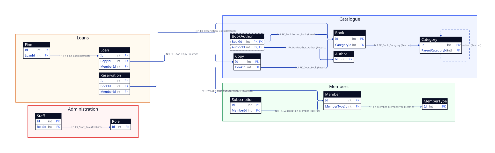

# ef-d2-diagram-skill-demo

Demonstration of database diagram generation from an **Entity Framework Core** model, using the GitHub Copilot skill [`efcore-d2-db-diagram`](.github/skills/efcore-d2-db-diagram/SKILL.md).

---

## Table of Contents

- [Project Overview](#project-overview)
- [Prerequisites](#prerequisites)
- [Using the efcore-d2-db-diagram Skill](#using-the-efcore-d2-db-diagram-skill)
- [Generated Diagram](#generated-diagram)
- [Bounded Contexts Description](#bounded-contexts-description)
- [Regenerating the Diagram](#regenerating-the-diagram)
- [Installing the Skill on Another Project](#installing-the-skill-on-another-project)

---

## Project Overview

This project contains an EF Core model representing a library management application (`LibraryDbContext`). It demonstrates how the **efcore-d2-db-diagram** skill can automatically analyse entities, Fluent API configurations and relationships to produce an ERD diagram in [D2](https://d2lang.com/) format.

Project structure:

```
Library.Data/
├── LibraryDbContext.cs          # Main DbContext
├── Domain/
│   ├── Administration/          # Staff, Role, AuditLog
│   ├── Catalogue/               # Book, Author, BookAuthor, Category, Copy
│   ├── Loans/                   # Loan, Reservation, Fine
│   └── Members/                 # Member, MemberType, Subscription
├── Configurations/              # IEntityTypeConfiguration<T> per entity
└── Enums/                       # BookCondition, LoanStatus, ReservationStatus
```

---

## Prerequisites

| Tool | Purpose |
|---|---|
| [.NET 8+](https://dotnet.microsoft.com/) | Build the C# project |
| [d2 CLI](https://github.com/terrastruct/d2) | Validate and render `.d2` files |
| GitHub Copilot (agent mode) | Invoke the efcore-d2-db-diagram skill |

Install `d2`:

```bash
# macOS / Linux
curl -fsSL https://d2lang.com/install.sh | sh -s --

# Windows (winget)
winget install terrastruct.d2
```

---

## Using the efcore-d2-db-diagram Skill

The skill is installed at [`.github/skills/efcore-d2-db-diagram/SKILL.md`](.github/skills/efcore-d2-db-diagram/SKILL.md).

### Applied Workflow

The skill follows this automated process:

1. **Read the project structure** — detect the `DbContext`, `DbSet<T>` declarations and entity folders.
2. **Analyse entities** — extract properties, primary keys, foreign keys and navigation properties.
3. **Read Fluent API configurations** — `IEntityTypeConfiguration<T>` for table names, constraints, indexes and delete behaviors.
4. **Build the normalised database model** — group by bounded context (Catalogue, Members, Loans, Administration).
5. **Generate the `.d2` file** — key-only columns, annotated relationships and per-context styles.
6. **Validate syntax** — `d2 fmt library-schema.d2`.
7. **Render SVG** — `d2 --layout=elk library-schema.d2 library-schema.svg`.

### Generation Parameters

| Parameter | Value |
|---|---|
| DbContext | `LibraryDbContext` (auto-detected) |
| Columns displayed | Keys only (PK / FK) |
| Column types | Yes |
| Nullable markers | Yes |
| Indexes | Yes |
| Enum values | No |
| Owned types | Inline |
| Many-to-many join tables | Explicit |
| Technical/audit tables | Hidden (`AuditLog`) |
| Grouping | Bounded context |
| Layout | `elk` |
| Output format | `.d2` + `.svg` |

### Invoking in GitHub Copilot

In VS Code agent mode, simply ask:

> *"Generate the base diagram using the efcore-d2 skill"*

Copilot automatically loads the skill, analyses the source code and produces the [`library-schema.d2`](library-schema.d2) file.

---

## Generated Diagram

> Source file: [`library-schema.d2`](library-schema.d2)



---


## Regenerating the Diagram

After modifying the EF Core model, regenerate the diagram in two steps:

```bash
# 1. Ask Copilot to regenerate (agent mode)
# "Regenerate the database diagram"

# 2. Validate and render manually
d2 fmt library-schema.d2
d2 --layout=elk library-schema.d2 library-schema.svg
```

---

## Installing the Skill on Another Project

The `efcore-d2-db-diagram` skill is self-contained and can be dropped into any repository. It works with **GitHub Copilot** (VS Code agent mode) and **Claude** (via the MCP filesystem or any agent that reads workspace files).

### 1. Copy the skill files

Copy the following folder structure into the root of your target repository:

```
.github/
└── skills/
    └── efcore-d2-db-diagram/
        ├── SKILL.md                        # Main skill instructions
        └── references/
            ├── d2-erd-style.md             # D2 syntax and visual conventions
            ├── efcore-model-extraction.md  # EF Core extraction rules
            ├── grouping-modes.md           # Grouping strategies
            ├── quality-gate.md             # Pre-delivery checklist
            └── relationship-rules.md       # Relationship inference rules
```

You can copy the files directly from this repository:

```bash
# From your target project root
mkdir -p .github/skills
cp -r /path/to/ef-d2-diagram-skill-demo/.github/skills/efcore-d2-db-diagram \
      .github/skills/
```

Or clone and copy on Windows:

```powershell
Copy-Item -Recurse `
  "C:\src\ef-d2-diagram-skill-demo\.github\skills\efcore-d2-db-diagram" `
  ".github\skills\"
```

### 2. Use with GitHub Copilot (VS Code)

No configuration file is needed. GitHub Copilot agent mode automatically discovers skills placed under `.github/skills/` when the skill's `SKILL.md` contains a valid frontmatter `name` field.

**Requirements:**
- VS Code with the [GitHub Copilot](https://marketplace.visualstudio.com/items?itemName=GitHub.copilot) and [GitHub Copilot Chat](https://marketplace.visualstudio.com/items?itemName=GitHub.copilot-chat) extensions
- Agent mode enabled (`Chat: Agent Mode` in VS Code settings)

**Invoke the skill:**

Open the Copilot Chat panel, switch to **agent mode** and type:

> *"Generate the database diagram from my EF Core model"*

Copilot detects the skill, reads your `DbContext`, entities and Fluent API configurations, then produces the `.d2` file and optionally renders it to SVG.

### 3. Use with Claude (Anthropic)

Claude can use this skill when it has access to your repository files, either through the **MCP filesystem server** or by working directly in a VS Code workspace with the Copilot Chat extension configured to use Claude as the underlying model.

**Option A — Claude via GitHub Copilot (model switch)**

If your GitHub Copilot subscription supports Claude models, switch the model in the Copilot Chat panel and invoke the skill exactly the same way as with Copilot:

> *"Generate the database diagram using the efcore-d2 skill"*

The skill file at `.github/skills/efcore-d2-db-diagram/SKILL.md` is automatically picked up regardless of the underlying model.

**Option B — Claude with MCP filesystem**

If you are using Claude Desktop or Claude API with the [MCP filesystem server](https://github.com/modelcontextprotocol/servers/tree/main/src/filesystem), configure it to expose your project root, then instruct Claude to read the skill:

```json
// claude_desktop_config.json  (MCP server configuration)
{
  "mcpServers": {
    "filesystem": {
      "command": "npx",
      "args": [
        "-y",
        "@modelcontextprotocol/server-filesystem",
        "/path/to/your/project"
      ]
    }
  }
}
```

Then prompt Claude:

> *"Read the skill at `.github/skills/efcore-d2-db-diagram/SKILL.md` and follow its instructions to generate a D2 database diagram from the EF Core model in this project."*

### 4. Skill file structure reference

| File | Purpose |
|---|---|
| `SKILL.md` | Entry point — workflow, default parameters, mandatory questions, quality gate |
| `references/efcore-model-extraction.md` | Rules for reading `DbContext`, `DbSet`, Fluent API and migrations |
| `references/d2-erd-style.md` | D2 syntax and visual conventions for ERD diagrams |
| `references/relationship-rules.md` | How to infer 1:1, 1:N, N:N and owned relationships |
| `references/grouping-modes.md` | Bounded-context, schema, namespace and flat grouping rules |
| `references/quality-gate.md` | Final checklist before delivering the generated diagram |
